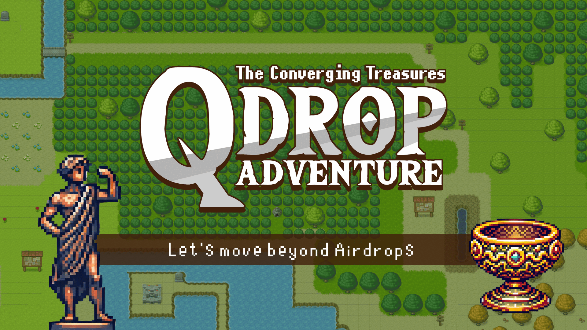
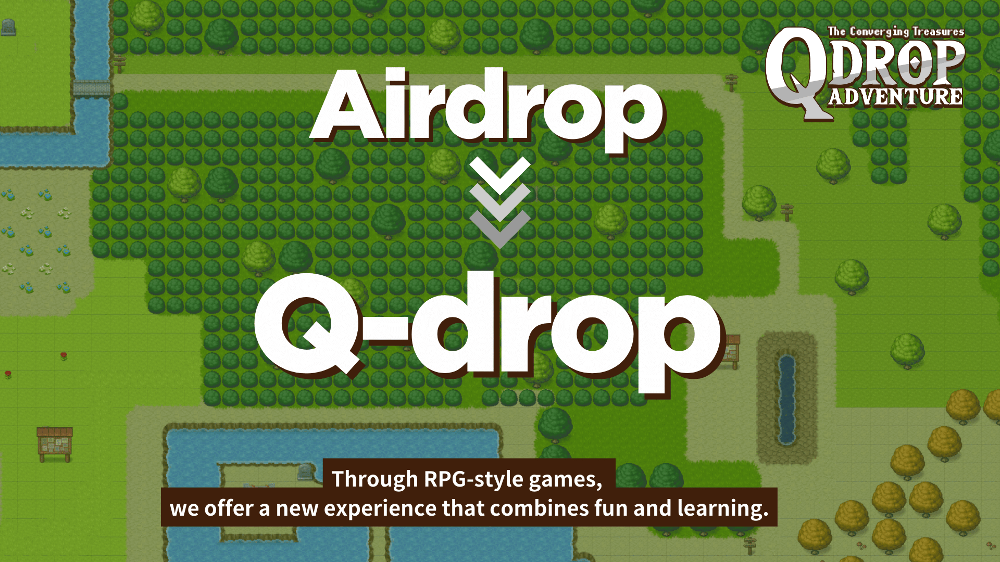
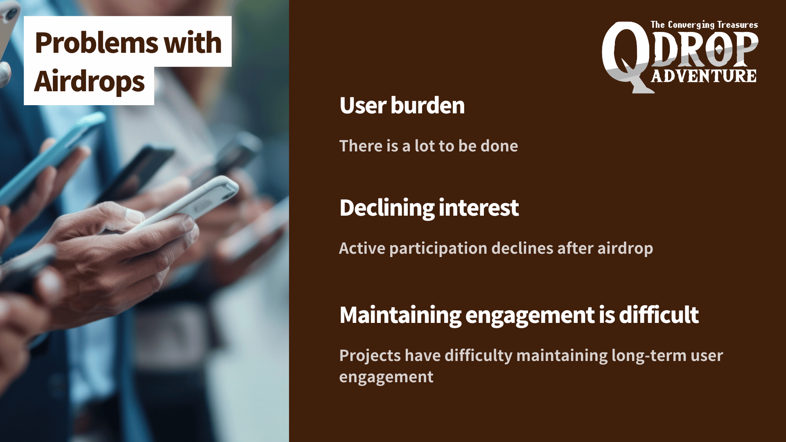
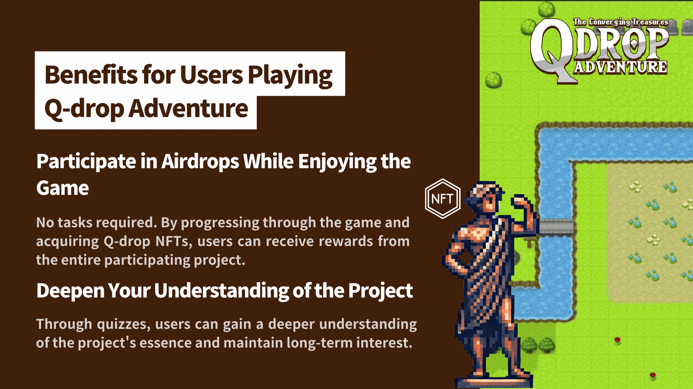
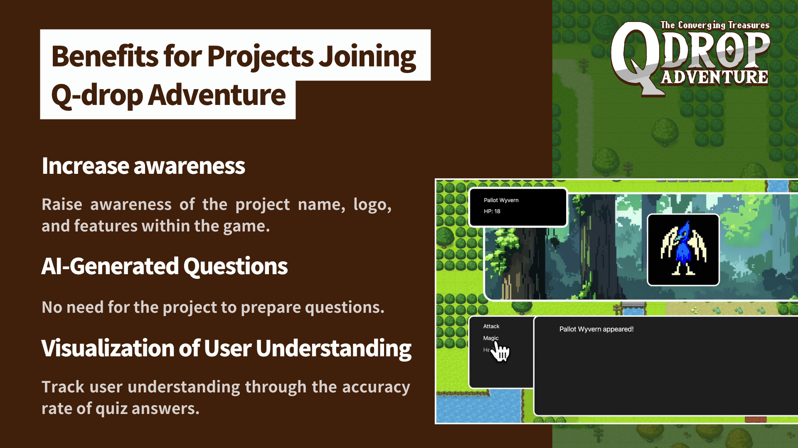
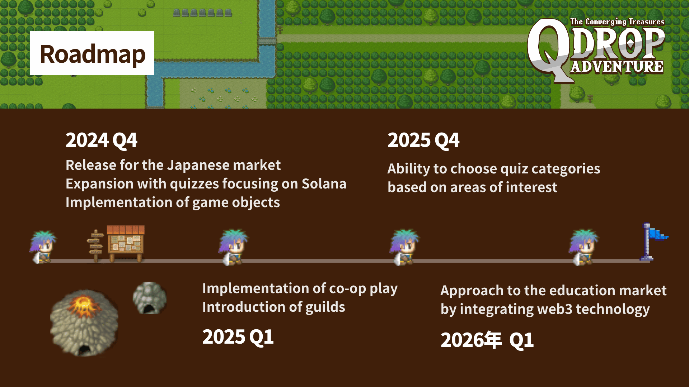
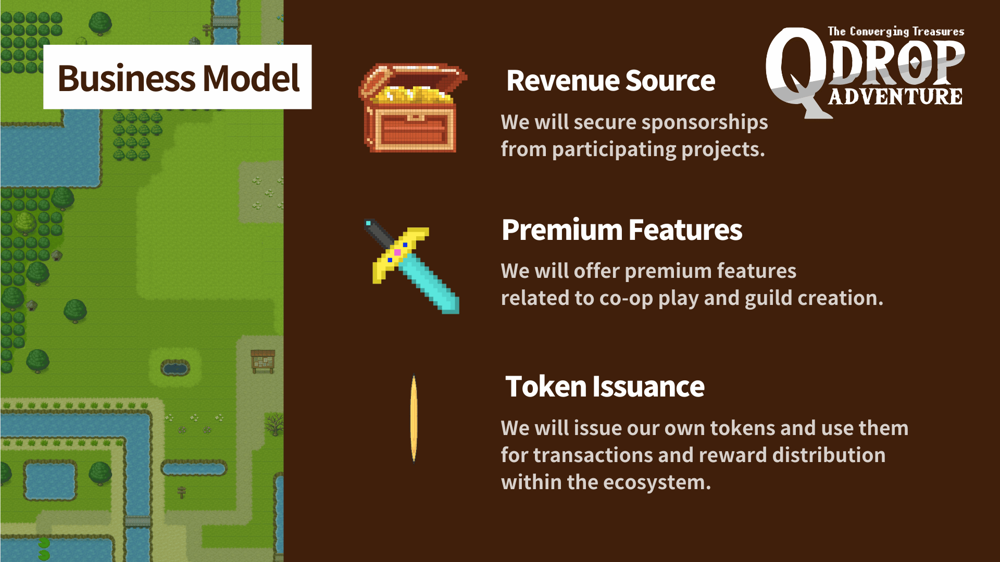

# Q-drop Adventure

[](https://github.com/ytakahashi2020/airdrop_quest/actions/workflows/ci.yml)



## About Q-drop Adventure













## Regarding Certain Behaviors:

Monsters, challenges, and monster stats are all automatically generated by AI. As a result, some behaviors may become slow or laggy.

## Live Demo

[vercel - https://qdropadventure.vercel.app/](https://qdropadventure.vercel.app/)

## Pitch Video

[Loom - Pitch Video](https://www.loom.com/share/b1b8d8710510400cacf7ecfeca59c4f1)

## Silde

[Canva - Pitch Deck](https://www.canva.com/design/DAGSeD3VV-8/7NY0PWR8QbAc5Cje4XG94g/watch?embed)

## Project Page

[Colosseum - Q-drop Adventure](https://arena.colosseum.org/refresh-session?redirectBack=/projects/hackathon/q-drop-adventure)

## Team Info

- [ytakahashi2020](https://github.com/ytakahashi2020)
- [harukaoda15](https://github.com/harukaoda15)
- [CobaltSato](https://github.com/CobaltSato)
- [mashharuki](https://github.com/mashharuki)

## API Info

- **setUp**

  you must create OpenAI API Key.

  [https://platform.openai.com/api-keys](https://platform.openai.com/api-keys)

- **API Methods**

  | No. | Name                     | method | path                    | Overview                    |
  | :-- | :----------------------- | :----- | :---------------------- | :-------------------------- |
  | 1   | geneate Moster data API  | POST   | /api/ai                 | generate Monster status     |
  | 2   | geneate Moster Image API | POST   | /api/ai/generateImage   | generate Monster Image data |
  | 3   | mint winner NFT API      | POST   | /api/nft/mint/winnerNft | mint Winner NFT             |
  | 4   | mint statue NFT API      | POST   | /api/nft/mint/statue    | mint statue NFT             |

  以下の API のみ AWS CDK を使って AWS 上にサーバーレス API としてデプロイしています。  
  ※ 実行には API キーが必要です。

  エンドポイント： **https://aga2m7qtr3.execute-api.ap-northeast-1.amazonaws.com**

  | No. | Name                 | method | path          | Overview                       |
  | :-- | :------------------- | :----- | :------------ | :----------------------------- |
  | 1   | geneate Question API | POST   | /generateQuiz | generate Quiz about MagicBlock |

## Backend Wallet for minting Metaplex NFT

**This key is a development key!!**  
**Please don't use this key on mainnet**

[9Vp31rJaFAbJSvNE3jjuyKAsbEtGefzAJdXeHmcn1TFz](https://explorer.solana.com/address/9Vp31rJaFAbJSvNE3jjuyKAsbEtGefzAJdXeHmcn1TFz?cluster=devnet)

## How to work

- **setUp**

  You must create `.env.local` file & set below values

  ```txt
  NEXT_PUBLIC_OPENAI_API_KEY=""
  NEXT_PUBLIC_AWS_APIGATEWAY_API_KEY=""
  ```

  and you must install modules

  ```bash
  yarn
  ```

- **build frontend**

  ```bash
  yarn build
  ```

- **start frontend**

  ```bash
  yarn dev
  ```

## Q-drop Adventure Achievements

- **Held a total of 3 AMAs:**

  - 1st session  
    https://x.com/a_kingdom_radar/status/1840533171953447184
  - 2nd session  
    https://x.com/a_kingdom_radar/status/1840893919397364157
  - 3nd session  
    https://x.com/a_kingdom_radar/status/1841781082506883570

- **Youtube**

  https://www.youtube.com/playlist?list=PL1rRUVBEqXMl7SeYddmvv2viR-gmaD1k9

- **Released the alpha version and conducted a survey**

  https://x.com/stand_english/status/1841045290008396246

- **Founder Yuki's Achievements in Superteam (relevant to our aim of entering the education sector)**

  - He is a member of Metaplex Japan

    https://x.com/stand_english/status/1826593233201508505

  - Authored 105 Solana-related articles (in Japanese)

    https://note.com/standenglish/m/m4b49800d8ae2

  - Created 51 Solana videos (in Japanese)

    https://www.youtube.com/playlist?list=PL1rRUVBEqXMnA5tRwhU1JWNlt6-hga1yi

  - Organized two Solana retreats:

    - 1st retreat: Kujukuri
      https://x.com/stand_english/status/1812094715216687137

    - 2nd retreat: Atami
      https://x.com/stand_english/status/1822212193774977412
      
    - Hosted a Solana mini-hackathon and spoke at various other events
      https://x.com/stand_english/status/1812422836948189257

  - Locations and Events

    - Osaka:  
      https://x.com/stand_english/status/1814552534335561819

    - Okinawa:  
      https://x.com/stand_english/status/1813151225652912226

    - Fukuoka:  
      https://x.com/SuperteamJapan/status/1842545366329414139

    - Pyth Dev Demos:  
      https://x.com/stand_english/status/1817737026105753694

    ...and many more.
